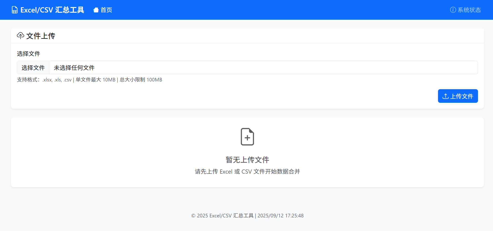
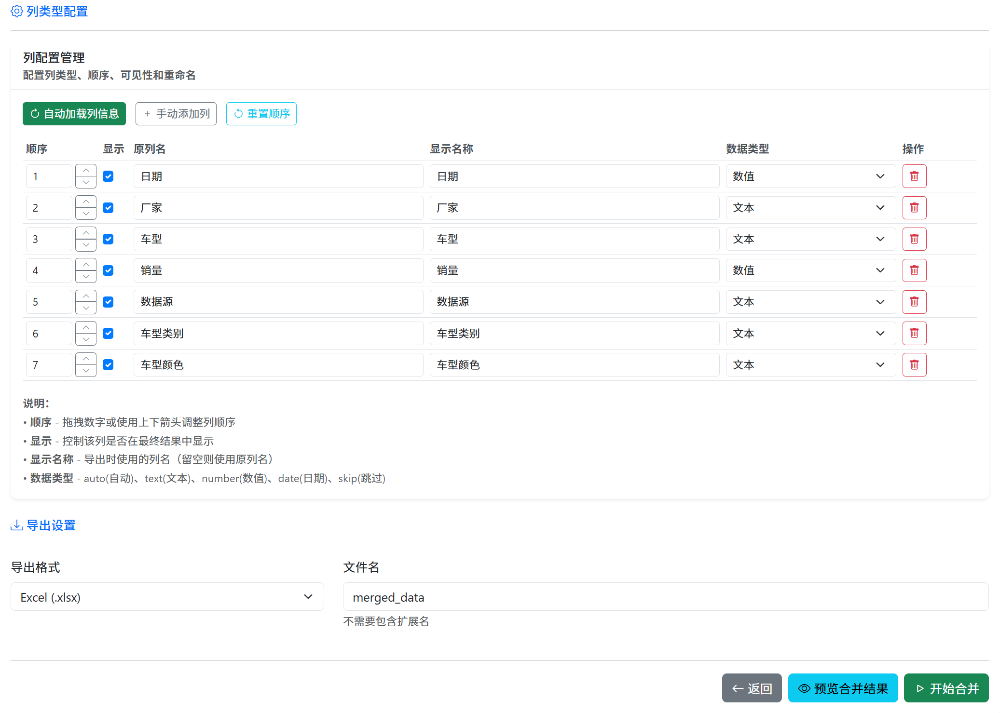
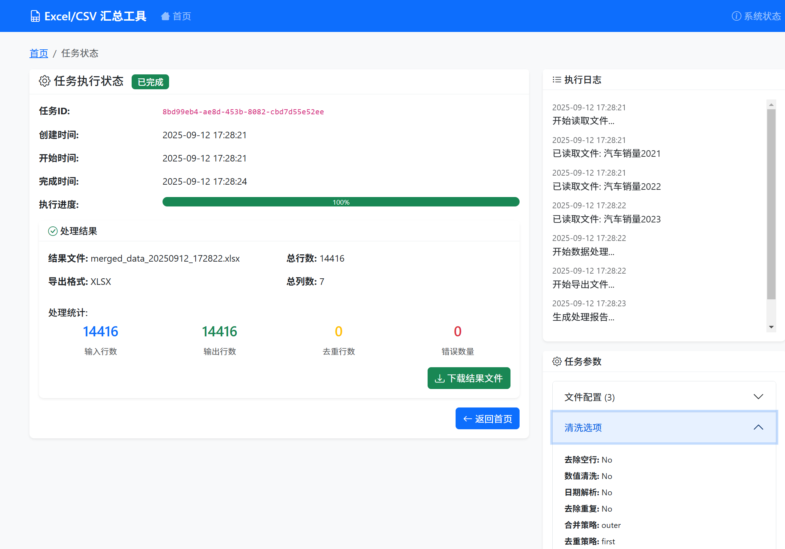

# Excel/CSV 汇总与清洗工具

一个基于 Flask 的现代化 Web 应用，用于批量处理和合并 Excel/CSV 文件，支持数据清洗、预览配置和高级列管理功能。








## 功能特性

### 核心功能

- **多文件上传**: 支持同时上传多个 Excel (.xlsx, .xls) 和 CSV 文件
- **智能预览**: 自动检测文件编码，支持多工作表预览和实时数据预览
- **高级列管理**:
  - 智能列类型检测（数字、日期、文本、布尔值）
  - 拖拽式列排序
  - 列重命名功能
  - 灵活的列显示/隐藏控制
  - 列配置保存和恢复
- **实时预览**: 配置更改时即时查看合并结果
- **灵活配置**: 可自定义表头行、数据源名称、工作表选择
- **数据合并**: 按列名自动合并，支持外连接和内连接策略
- **数据清洗**:
  - 去除空行和重复数据
  - 智能数值清洗（去千分位符、货币符号）
  - 日期格式统一和标准化
  - 文本格式标准化
- **多格式导出**: 支持导出为 Excel (.xlsx) 或 CSV 格式
- **后台处理**: 异步任务处理，支持进度跟踪和状态监控
- **错误报告**: 详细的处理日志和错误样例
- **自动清理**: 智能文件管理和隐私保护

### 技术特性

- **现代化界面**: Bootstrap 5 响应式设计，支持移动端
- **单机部署**: 无需外部数据库或队列服务
- **内存优化**: 适合中等规模数据处理
- **实时反馈**: WebSocket 风格的状态更新
- **安全可靠**: 自动文件清理，保护数据隐私

## 快速开始

### 环境要求

- Python 3.9+
- Windows/Linux/macOS

### 安装步骤

1. **克隆或下载项目**

   ```bash
   # 如果从Git获取
   git clone <repository-url>
   cd excel_tool

   # 或直接使用下载的文件夹
   cd excel_tool
   ```
2. **安装依赖**

   ```bash
   pip install -r requirements.txt
   ```
3. **启动应用**

   **Windows 用户（推荐）:**

   ```bash
   # 双击运行启动脚本
   start.bat

   # 或在命令行运行
   start.bat
   ```

   **跨平台启动:**

   ```bash
   python app.py
   ```
4. **访问应用**
   打开浏览器访问: http://localhost:5000

## 使用指南

### 基本工作流程

1. **上传文件**

   - 在首页选择或拖拽文件到上传区域
   - 支持 .xlsx, .xls, .csv 格式
   - 单文件最大 100MB，总大小限制 500MB
2. **配置和预览**

   - 选择要处理的文件和工作表
   - 设置表头行（从第几行开始是表头）
   - **高级列管理**:
     - 查看智能检测的列类型（数字、日期、文本等）
     - 拖拽列标题重新排序
     - 双击列名进行重命名
     - 使用可见性开关控制列的显示/隐藏
   - **实时预览**: 查看配置应用后的合并结果
   - 配置数据源名称和清洗选项
3. **执行任务**

   - 提交配置后系统会创建后台任务
   - 实时查看处理进度和详细日志
   - 任务完成后可下载结果文件
4. **查看结果**

   - 下载合并后的文件
   - 查看详细的处理统计信息
   - 检查错误样例和数据质量报告

### 高级功能

#### 列管理系统

- **智能类型检测**:
  - 自动识别数字、日期、文本、布尔值等数据类型
  - 基于内容智能推断最适合的数据类型
- **拖拽排序**:
  - 在配置页面直接拖拽列标题调整顺序
  - 实时预览排序效果
- **列重命名**:
  - 双击列名进行快速重命名
  - 支持中英文和特殊字符
- **显示控制**:
  - 灵活控制哪些列显示在最终结果中
  - 隐藏的列不会影响数据处理逻辑

#### 实时预览系统

- **配置预览**: 查看所有配置应用后的效果
- **数据预览**: 实时显示合并和清洗后的数据样本
- **统计信息**: 显示行数、列数、数据质量等关键指标

### 数据清洗选项

#### 基础清洗

- **去除空行**: 删除完全为空或关键列为空的行
- **数值清洗**:
  - 移除千分位分隔符 (,)
  - 移除货币符号 ($, €, ¥, ￥, £, ₹, ₽)
  - 转换为标准数值格式
- **日期解析**:
  - 自动识别常见日期格式
  - 统一输出为 YYYY-MM-DD 格式
- **去除重复**: 基于所有列或指定列去重

#### 高级选项

- **合并策略**:
  - 外连接: 保留所有列，缺失列补空值
  - 内连接: 只保留所有文件共有的列
- **去重策略**:
  - 保留第一条记录
  - 保留最后一条记录
- **关键列设置**: 指定用于判断空行的关键列

### 配置文件

应用配置在 `config.py` 中，主要参数：

```python
# 文件大小限制
MAX_FILE_SIZE = 100 * 1024 * 1024  # 100MB
MAX_CONTENT_LENGTH = 500 * 1024 * 1024  # 500MB

# 预览设置
DEFAULT_PREVIEW_ROWS = 50
MAX_PREVIEW_ROWS = 200

# 任务设置
MAX_CONCURRENT_TASKS = 1
TASK_TIMEOUT = 3600  # 1小时

# 文件保留
FILE_RETENTION_DAYS = 1
```

## 项目结构

```
excel_tool/
├── app.py                 # Flask 应用主文件
├── config.py              # 配置文件
├── run.py                 # Python启动脚本
├── start.bat              # Windows启动脚本
├── requirements.txt       # 依赖包列表
├── file_manager.py        # 文件管理模块
├── data_processor.py      # 数据处理模块
├── task_manager.py        # 任务管理模块
├── check_paths.py         # 路径配置检查工具
├── static/                # 静态文件
│   ├── css/
│   │   └── style.css      # 自定义样式
│   └── js/
│       └── app.js         # 前端交互脚本
├── templates/             # HTML 模板
│   ├── base.html          # 基础模板
│   ├── index.html         # 首页
│   ├── configure.html     # 配置页（含列管理）
│   ├── task.html          # 任务状态页
│   └── error.html         # 错误页面
├── uploads/               # 上传文件目录
├── results/               # 结果文件目录
└── logs/                  # 日志目录
```

## API 接口

### 文件操作

- `POST /upload` - 文件上传
- `GET /api/preview/<file_id>` - 文件预览
- `GET /api/detect_columns/<file_id>` - 列类型检测
- `DELETE /api/delete_file/<file_id>` - 删除文件
- `DELETE /api/clear_all_files` - 清空所有文件

### 配置管理

- `POST /preview_merge` - 预览合并结果
- `GET /api/column_config` - 获取列配置
- `POST /api/column_config` - 保存列配置

### 任务管理

- `POST /submit_task` - 提交合并任务
- `GET /api/task/<task_id>` - 获取任务状态
- `GET /task/<task_id>` - 任务状态页面

### 系统信息

- `GET /api/system_status` - 系统状态
- `GET /download/<filename>` - 文件下载

## 部署说明

### 开发环境

```bash
# 使用Python启动
python app.py

# 或使用Windows启动脚本
start.bat
```

### 生产环境 (使用 Gunicorn)

```bash
# 安装 Gunicorn
pip install gunicorn

# 启动服务
gunicorn -w 4 -b 0.0.0.0:5000 app:app
```

### Docker 部署

```dockerfile
FROM python:3.9-slim

WORKDIR /app
COPY requirements.txt .
RUN pip install -r requirements.txt

COPY . .

EXPOSE 5000
CMD ["python", "run.py"]
```

## 注意事项

### 安全考虑

- 本工具设计用于内网或单用户环境
- 如需公网部署，请添加用户认证和 HTTPS
- 定期清理上传的临时文件

### 性能限制

- 默认单线程处理，适合中等规模数据
- 大文件处理可能需要较长时间
- 内存使用量与文件大小相关

### 支持的格式

- Excel: .xlsx, .xls
- CSV: 自动检测编码 (UTF-8, GBK, GB2312 等)
- 日期格式: 自动识别常见格式
- 数值格式: 支持千分位符和货币符号

## 常见问题

### Q: 文件上传失败

A: 检查文件大小是否超限，确保网络连接稳定

### Q: 日期解析错误

A: 确保日期格式为常见格式，或在源文件中统一格式

### Q: 内存不足

A: 减少同时处理的文件数量，或分批处理大文件

### Q: 中文显示乱码

A: 在Windows下使用start.bat启动脚本可自动设置正确的字符编码

### Q: 列管理功能无法使用

A: 确保浏览器支持现代JavaScript特性，建议使用Chrome、Firefox或Edge

### Q: 预览功能加载缓慢

A: 预览功能会处理数据样本，大文件可能需要等待几秒钟

## 更新日志

### v2.0.0 (2025-09-12)

- **新增**: 高级列管理系统
  - 智能列类型检测
  - 拖拽式列排序
  - 列重命名功能
  - 灵活的显示/隐藏控制
- **新增**: 实时预览功能
  - 配置更改即时预览
  - 完整的数据处理预览
- **增强**: 文件管理系统
  - 一键清空所有文件
  - 智能文件清理
  - 路径配置优化
- **修复**: 中文编码问题
- **优化**: 用户界面和交互体验

### v1.0.0 (2025-01-20)

- 初始版本发布
- 支持基本的文件合并和数据清洗功能
- 提供 Web 界面和 API 接口

## 技术支持

如遇问题，请检查：

1. Python 版本是否满足要求
2. 依赖包是否正确安装
3. 文件权限是否足够
4. 日志文件中的错误信息

## 许可证

MIT License - 可自由使用和修改
